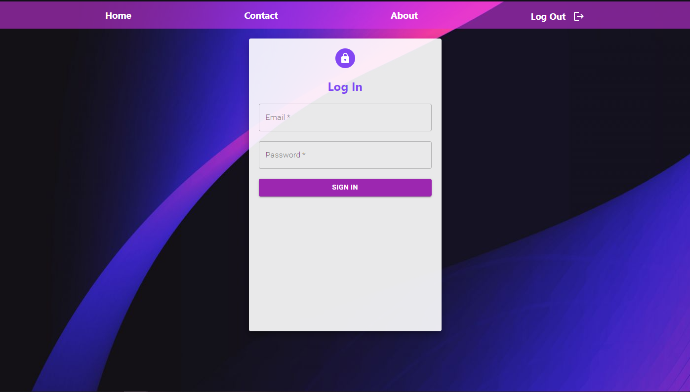
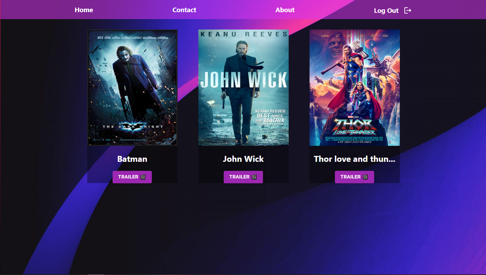
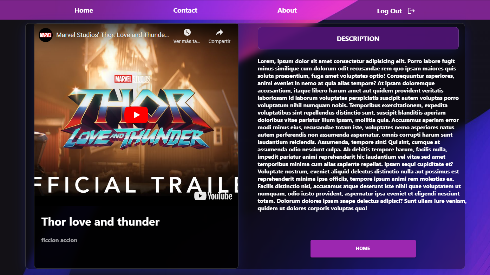

# BeMaster Challenge
Front End BeMaster challenge

## Imagenes

  

  

  

## Pasos para correr la app
Para correr la web debemos seguir los siguientes pasos

# 1 Clonar repositorio
# 2. Posicionarnos en raiz del directorio "client" y ejecutar en consola el comando npm install
# 3 Levantar front end
• En la raiz del directorio "client" ejecutar comando npm start en consola

# 4 Utilizar alguna de las cuentas dentro del archivo UsersMock.json (escribir bien email y password) en el login para entrar, pueden usar esta cuenta: email: "ale@gmail.com", password: "1234"

# Disfrutar de la web
